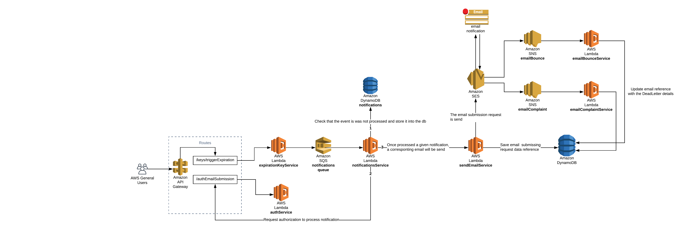
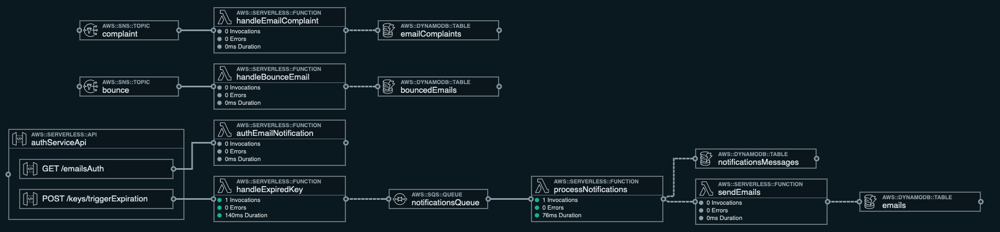

# aws-sam-email-notification-system

> AWS Workshop

This is a serverless application to send emails and handle emails bouncing and complains.

## Description

System to send email notifications and handle dead-letters(undeliverable mail) such as emails bounces and emails complaints.

The stack is an orchestration of :

1. API Gateway
2. Lambda Functions
3. SQS
4. SNS
5. SES
6. DynamoDB

## Solution Diagrams

### AWS Architecture Diagram

### SAM Template Architecture Diagram

